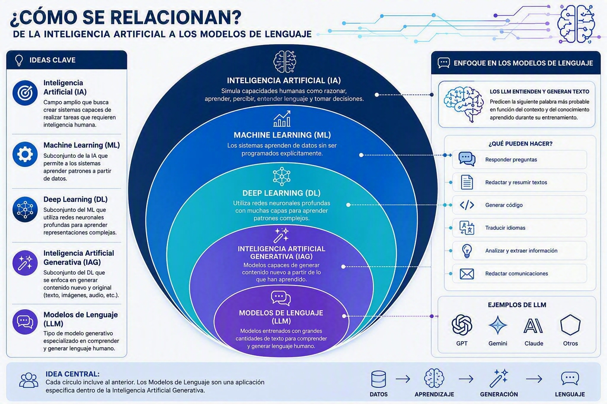
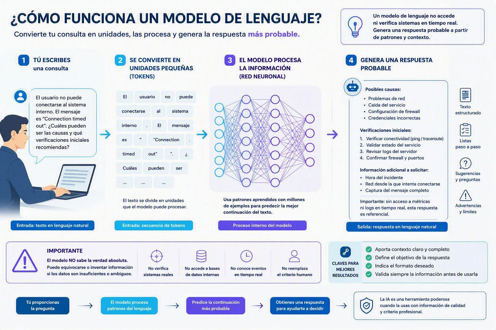
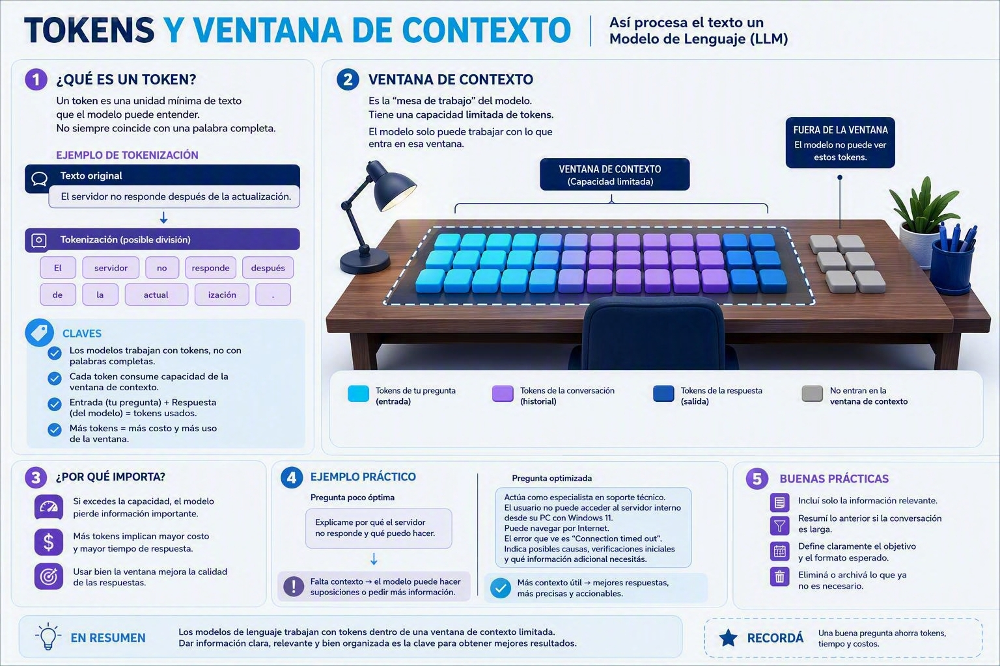
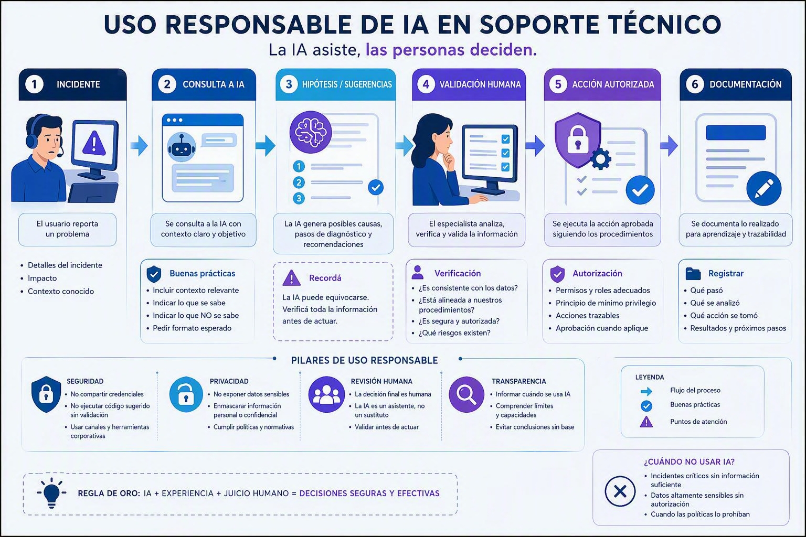

# Clase 1: Fundamentos de Inteligencia Artificial Generativa

**Capacitación en Inteligencia Artificial y Automatización Aplicada a Soporte Técnico**  
**Casinos Play**

---

## Objetivo de la clase

Comprender qué es la Inteligencia Artificial Generativa, cómo funcionan de manera general los modelos de lenguaje y cuáles son sus principales capacidades, limitaciones y riesgos en tareas de soporte técnico.

Al finalizar la clase, los participantes podrán:

- Diferenciar Inteligencia Artificial, Machine Learning e Inteligencia Artificial Generativa.
- Explicar de manera sencilla qué es un modelo de lenguaje.
- Comprender los conceptos de token, contexto y ventana de contexto.
- Reconocer alucinaciones, supuestos y limitaciones en una respuesta generada por IA.
- Comparar respuestas de diferentes modelos.
- Identificar casos de uso aplicables al trabajo cotidiano de soporte.

---

## Modalidad

La clase combina explicaciones breves, demostraciones del instructor, actividades grupales y ejercicios prácticos.

No se requiere experiencia previa en programación.

### Dinámica de trabajo

```text
Concepto → demostración → práctica → comparación → conclusión
```

---

## 1. Actividad inicial: ¿qué consideramos Inteligencia Artificial?

Antes de comenzar, analizar las siguientes situaciones:

1. Un sistema asigna automáticamente la prioridad de un incidente aplicando reglas definidas previamente.
2. Un chatbot responde preguntas escritas por un usuario.
3. Un modelo analiza datos históricos e intenta predecir una falla.
4. Una herramienta envía un correo cuando recibe una nueva solicitud.
5. Un asistente interpreta un mensaje de error y propone posibles verificaciones.

### Preguntas para el grupo

- ¿Cuáles de estas situaciones utilizan Inteligencia Artificial?
- ¿Cuáles podrían resolverse solamente con automatización?
- ¿En cuáles existe generación de contenido?
- ¿Qué información adicional necesitaríamos para responder con seguridad?

### Idea principal

```text
Automatización ≠ Inteligencia Artificial
Machine Learning ≠ Inteligencia Artificial Generativa
Chatbot ≠ Agente de Inteligencia Artificial
```

Estas tecnologías pueden combinarse, pero no significan lo mismo.

---



## 2. ¿Qué es la Inteligencia Artificial?

La Inteligencia Artificial es un campo que desarrolla sistemas capaces de realizar tareas asociadas con capacidades humanas, como reconocer patrones, interpretar lenguaje, clasificar información, realizar predicciones o generar contenido.

### Mapa general

```text
Inteligencia Artificial
│
├── Sistemas basados en reglas
│
├── Machine Learning
│   └── Deep Learning
│
└── Inteligencia Artificial Generativa
    └── Modelos de lenguaje
```

### Diferencias principales

#### Inteligencia Artificial

Es el concepto general. Incluye diversas técnicas para construir sistemas que realizan tareas complejas.

#### Machine Learning

Es una rama de la Inteligencia Artificial en la que los sistemas identifican patrones a partir de datos, sin depender exclusivamente de reglas escritas una por una.

#### Inteligencia Artificial Generativa

Es un tipo de Inteligencia Artificial capaz de generar contenido nuevo, como texto, imágenes, audio, código o estructuras de datos.

---

## 3. Software tradicional e IA generativa

### Software tradicional

```text
Entrada + reglas definidas → resultado
```

El sistema sigue instrucciones previamente programadas y, frente a las mismas condiciones, suele producir resultados previsibles.

### IA generativa

```text
Entrada + instrucciones + contexto + modelo → respuesta generada
```

La respuesta se construye a partir de patrones aprendidos durante el entrenamiento y de la información disponible en la conversación.

### Ejemplo aplicado a soporte

**Entrada:**

> El servicio dejó de responder después de una actualización.

**Una IA podría generar:**

- preguntas de diagnóstico;
- posibles causas;
- un procedimiento inicial;
- una comunicación para el usuario;
- un resumen del incidente.

### Advertencia importante

La IA no está verificando realmente el servidor ni conoce necesariamente el estado del sistema. Genera una respuesta a partir del texto recibido, de sus instrucciones y de los patrones aprendidos.

---

## 4. ¿Qué es un modelo de lenguaje?



Un modelo de lenguaje es un sistema entrenado con grandes cantidades de texto para identificar patrones y generar secuencias de lenguaje.

De manera simplificada, recibe un texto y estima qué contenido debería continuar según:

- las instrucciones recibidas;
- el contexto disponible;
- los patrones aprendidos;
- la conversación previa;
- los límites configurados en la herramienta.

### Actividad breve

Completar la siguiente oración:

> El usuario no puede ingresar al sistema porque...

Comparar las respuestas del grupo.

### Reflexión

- No todos completaron la oración de la misma manera.
- Varias respuestas pueden resultar posibles.
- Sin contexto adicional, aparecen suposiciones.
- Una continuación probable no necesariamente describe lo que ocurrió en la realidad.

Un modelo de lenguaje trabaja con una lógica conceptualmente parecida, aunque a una escala y complejidad mucho mayores.

---

## 5. Tokens



Los modelos no procesan el texto exactamente como lo leemos las personas. Dividen el contenido en unidades denominadas **tokens**.

Un token puede representar:

- una palabra;
- una parte de una palabra;
- un signo de puntuación;
- un fragmento frecuente de texto.

### Ejemplo simplificado

```text
Texto:
El servidor no responde.

Posible división:
El | servidor | no | responde | .
```

La división real depende del modelo y de su tokenizador.

### ¿Por qué importan los tokens?

- Determinan cuánto texto puede procesar el modelo.
- Influyen en el costo cuando se utilizan servicios pagos mediante API.
- La entrada y la respuesta consumen tokens.
- Las conversaciones extensas acumulan contexto.
- Agregar información innecesaria puede aumentar el consumo y reducir la claridad.

### Idea principal

Un token es una **unidad de procesamiento de texto y medición de consumo**. No debe entenderse literalmente como una unidad de pensamiento.

---

## 6. Contexto y ventana de contexto

El **contexto** es la información que el modelo tiene disponible para elaborar una respuesta.

Puede incluir:

- el pedido actual;
- mensajes anteriores;
- instrucciones del sistema;
- documentos adjuntos;
- ejemplos proporcionados;
- resultados obtenidos desde otras herramientas.

La **ventana de contexto** es la cantidad máxima de información que el modelo puede considerar durante una interacción.

### Analogía

> La ventana de contexto es como una mesa de trabajo. El modelo puede trabajar con la información colocada sobre esa mesa, pero la mesa tiene un tamaño limitado.

### Comparación práctica

#### Consulta con poco contexto

```text
Solucioná este error.
```

#### Consulta con mayor contexto

```text
Actuá como asistente de soporte técnico.

Un usuario intenta acceder a un sistema interno desde Windows 11.
Puede navegar por Internet, pero no logra conectarse al servidor.
El mensaje recibido es: "Connection timed out".

Indicá:
1. Las primeras verificaciones que deberían realizarse.
2. Las posibles causas, diferenciándolas de los hechos confirmados.
3. La información adicional que debería solicitarse.
4. Las acciones que no deberían realizarse sin autorización.
```

### Preguntas para analizar

- ¿Cuál de las consultas permite generar una respuesta más útil?
- ¿Qué información evita que el modelo tenga que adivinar?
- ¿Una respuesta más detallada garantiza que sea correcta?
- ¿Qué pasos necesitarían validación humana?

---

## 7. Alucinaciones y limitaciones

Una **alucinación** ocurre cuando un modelo genera información falsa, incorrecta o no respaldada, pero la presenta de manera aparentemente convincente.

### Formas frecuentes

- Inventar una causa que no fue confirmada.
- Citar funciones o configuraciones inexistentes.
- Completar datos ausentes como si fueran hechos.
- Confundir una hipótesis con un diagnóstico.
- Proponer pasos incompatibles con el entorno real.
- Afirmar que realizó una acción que en realidad no pudo ejecutar.

### Regla central

> Una respuesta bien escrita no necesariamente es una respuesta correcta.



### Buenas prácticas

- Verificar información crítica.
- Diferenciar hechos, hipótesis y recomendaciones.
- Solicitar fuentes o documentación cuando corresponda.
- No compartir credenciales, secretos ni información sensible.
- No ejecutar comandos sin comprender su impacto.
- Mantener intervención humana en decisiones importantes.
- Probar primero en entornos controlados cuando corresponda.

---

## 8. Principales capacidades en soporte técnico

La IA generativa puede ayudar a:

- resumir incidentes;
- mejorar la redacción de comunicaciones;
- organizar información desestructurada;
- proponer preguntas de diagnóstico;
- convertir notas en procedimientos;
- explicar mensajes de error;
- adaptar documentación a diferentes públicos;
- clasificar solicitudes;
- extraer datos de textos;
- generar borradores de respuestas.

### Lo que no debe asumirse

La IA no necesariamente:

- conoce la infraestructura interna;
- tiene acceso a sistemas corporativos;
- verifica el estado real de un servicio;
- ejecuta las acciones que describe;
- conoce la versión actual de una aplicación;
- comprende todas las políticas internas;
- garantiza que su respuesta sea correcta o segura.

---

## 9. Demostración guiada

Utilizar el siguiente caso en las herramientas de IA disponibles.

### Caso

```text
Un usuario informa que una aplicación interna funciona con lentitud.
No se dispone de métricas, registros ni información adicional.
```

### Primera consulta

```text
¿Por qué está lenta la aplicación?
```

Observar si el modelo presenta suposiciones como hechos o si reconoce que necesita más información.

### Segunda consulta

```text
Actuá como asistente de un equipo de soporte técnico.

Un usuario informa que una aplicación interna funciona con lentitud.
No contamos todavía con métricas, registros ni información adicional.

Generá:
1. Cinco preguntas de diagnóstico.
2. Tres hipótesis posibles, aclarando que no están confirmadas.
3. Un orden inicial de verificación.
4. Una respuesta breve para enviar al usuario.
5. Una indicación clara sobre la información que falta.

No presentes ninguna hipótesis como causa confirmada.
```

### Análisis grupal

- ¿La segunda respuesta resultó más útil?
- ¿Qué cambió al incorporar contexto y restricciones?
- ¿El modelo respetó el formato solicitado?
- ¿Separó correctamente hechos e hipótesis?
- ¿Qué partes deberían validarse antes de utilizarlas?

---

## 10. Taller práctico: comparación de modelos

### Objetivo

Comparar cómo responden diferentes modelos frente a un mismo caso de soporte e identificar fortalezas, limitaciones, supuestos y riesgos.

### Organización

- Formar grupos de dos o tres participantes.
- Elegir uno de los casos propuestos.
- Utilizar el mismo prompt en al menos dos modelos disponibles.
- No ingresar información confidencial ni datos reales sensibles.
- Registrar las diferencias observadas.

### Casos sugeridos

#### Caso A: acceso

```text
Un usuario no puede ingresar a un sistema interno.
```

#### Caso B: rendimiento

```text
Una aplicación comenzó a funcionar lentamente durante el turno.
```

#### Caso C: comunicación

```text
Se produjo una interrupción temporal del servicio y debe informarse a los usuarios.
```

#### Caso D: documentación

```text
Un procedimiento técnico existe solamente como notas desordenadas y debe convertirse en un instructivo claro.
```

### Ronda 1: consulta mínima

Escribir una solicitud breve, sin agregar demasiado contexto.

Ejemplo:

```text
Ayudame a resolver este incidente.
```

Registrar los resultados y detectar las suposiciones realizadas por cada modelo.

### Ronda 2: consulta mejorada

Construir una nueva solicitud incorporando:

- contexto;
- objetivo;
- información conocida;
- información desconocida;
- restricciones;
- formato esperado.

### Plantilla orientativa

```text
Actuá como [rol].

Contexto:
[Describir la situación sin incluir información sensible].

Objetivo:
[Indicar qué resultado se necesita].

Información confirmada:
- [Dato 1]
- [Dato 2]

Información todavía no disponible:
- [Dato 1]
- [Dato 2]

Restricciones:
- No asumir datos no proporcionados.
- Diferenciar hechos de hipótesis.
- Indicar cuándo una acción requiere autorización.

Formato de respuesta:
1. Preguntas de diagnóstico.
2. Hipótesis posibles.
3. Verificaciones recomendadas.
4. Riesgos o precauciones.
5. Borrador de respuesta para el usuario.
```

---

## 11. Registro de resultados

### Modelo evaluado

- Nombre del modelo:
- Herramienta utilizada:
- Caso elegido:

### Evaluación

#### Fortalezas observadas

- 
- 
- 

#### Limitaciones observadas

- 
- 
- 

#### Supuestos o datos inventados

- 
- 
- 

#### Información adicional solicitada por el modelo

- 
- 
- 

#### Claridad de la respuesta

- [ ] Baja
- [ ] Media
- [ ] Alta

#### Utilidad para el trabajo de soporte

- [ ] No resulta utilizable
- [ ] Resulta parcialmente utilizable
- [ ] Resulta utilizable después de validarla
- [ ] Resulta utilizable sin cambios

#### ¿Usaríamos la respuesta en un caso real?

- [ ] Sí
- [ ] No
- [ ] Solo después de una revisión técnica

### Justificación

Escribir una conclusión breve:


---

## 12. Puesta en común

Cada grupo comparte:

1. El caso seleccionado.
2. Los modelos utilizados.
3. La diferencia más importante encontrada.
4. Un supuesto o riesgo detectado.
5. Una práctica que recomendaría al resto del equipo.

### Preguntas de cierre

- ¿Qué modelo fue más claro?
- ¿Cuál hizo mejores preguntas?
- ¿Cuál realizó más suposiciones?
- ¿Cuál respetó mejor las restricciones?
- ¿Qué respuesta requería mayor validación?
- ¿Qué información cambió más el resultado?

El objetivo no es elegir un modelo ganador, sino comprender que la calidad depende del caso, el contexto, las instrucciones y la validación humana.

---

## 13. Conclusiones de la clase

- La Inteligencia Artificial Generativa produce contenido a partir de patrones, instrucciones y contexto.
- Los modelos de lenguaje no conocen automáticamente el entorno real de la organización.
- Los tokens afectan la cantidad de información procesada y el consumo.
- Un contexto claro mejora la utilidad de las respuestas.
- Una respuesta convincente puede contener errores o información inventada.
- La IA puede asistir al equipo, pero no reemplaza la validación técnica.
- Nunca deben compartirse credenciales ni datos sensibles en herramientas no autorizadas.

---

