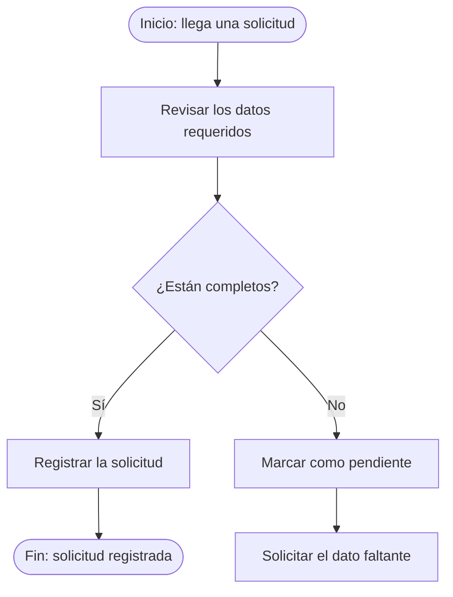
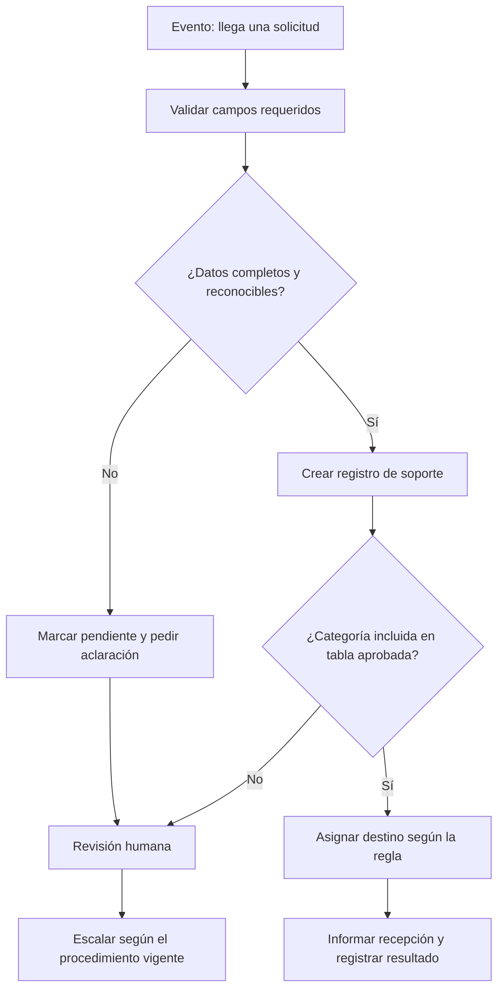

# Clase 4: Pensamiento de procesos y automatización

**Capacitación en Inteligencia Artificial y Automatización Aplicada a Soporte Técnico**  
**Casinos Play**

> Esta clase trabaja con un caso sintético de recepción y derivación de solicitudes. El objetivo es diseñar una automatización candidata, no conectarse a sistemas reales ni ejecutar acciones técnicas.

## Objetivo general

Aprender a observar tareas de soporte como partes de un proceso y reconocer cuándo una secuencia repetitiva, estable y gobernada por reglas explícitas puede automatizarse de forma segura.

## Resultados esperados

Al finalizar la clase vas a poder:

- explicar qué es una automatización y distinguirla de la inteligencia artificial;
- identificar tareas repetitivas y describir dónde empiezan y terminan;
- reconocer cuándo una tarea tiene un resultado determinístico y cuándo requiere interpretación o intervención humana;
- especificar entradas, pasos, reglas de negocio y salidas de un proceso;
- diferenciar un evento de un disparador y de una condición;
- mapear un proceso de soporte, incluyendo desvíos, información faltante y responsables;
- proponer una automatización acotada y justificar qué queda bajo control humano.

## Introducción: cómo leer un diagrama de flujo

Un **diagrama de flujo** representa los pasos y las decisiones de un proceso mediante formas conectadas por flechas. Permite ver dónde empieza y termina el recorrido, qué acciones suceden y qué caminos alternativos existen. No hace falta conocer una notación formal para seguirlo: alcanza con leerlo en el sentido de las flechas y preguntar qué significa cada forma.

| Forma habitual | Qué representa | Pregunta para leerla |
| --- | --- | --- |
| Óvalo | Inicio o final del recorrido | ¿Qué evento lo inicia? ¿Cuál es el resultado final? |
| Rectángulo | Una actividad o paso | ¿Qué acción se realiza y quién la hace? |
| Rombo | Una decisión o condición | ¿Qué pregunta se responde? ¿Qué salida corresponde a cada respuesta? |
| Flecha | El orden o dirección del flujo | ¿A qué paso se llega después? |

La imagen siguiente sirve como referencia visual de los símbolos. Está en inglés; los nombres y las explicaciones de esta guía están en español.

`Formas habituales de un diagrama de flujo: inicio o fin, actividad, decisión y flechas`


### Leer un ejemplo paso a paso

En este ejemplo didáctico, el flujo recibe una solicitud y comprueba si contiene los datos requeridos. No representa un procedimiento real del área.


---

Como ejemplo externo adicional, este flujograma muestra pasos y decisiones en un proceso de reparación de vehículos. 

Observá solamente la forma de representar el recorrido; no tomes sus pasos como un procedimiento de soporte ni como acciones autorizadas para automatizar.

`Ejemplo de flujograma aplicado a reparación de vehículos, útil para reconocer secuencias y decisiones`


### Para qué sirve en esta clase

El diagrama ayuda a conversar sobre el proceso antes de elegir una herramienta: hace visibles los pasos, las decisiones, las responsabilidades y los desvíos. Si una parte no se puede dibujar porque faltan pasos o reglas, esa incertidumbre se registra; no se rellena inventando.

---

## 1. Situación inicial: solicitudes que se vuelven a cargar

- Al equipo llegan solicitudes de soporte por distintos canales. 
- Para cada solicitud, alguien lee el mensaje, confirma los datos básicos, la registra, decide a qué grupo derivarla y avisa que fue recibida. 
- A veces se repiten los mismos pasos; otras veces falta la ubicación, no se reconoce el equipo o el caso requiere autorización.

> El equipo quiere reducir la carga repetitiva. 

Antes de elegir una herramienta, necesita responder:

1. ¿Qué pasos se repiten realmente?
2. ¿Qué datos hacen falta para completar cada paso?
3. ¿Qué decisiones siguen reglas conocidas y cuáles dependen de una evaluación humana?
4. ¿Qué debería hacer el proceso si falta información o algo no coincide?
5. ¿Qué acciones conviene mantener fuera de la automatización?

El alcance de trabajo será **registrar y derivar** una solicitud según información y reglas aprobadas. No se intentará diagnosticar ni reparar el equipo.

---

### Ejercicio mental: Aprendiendo a separar hechos y suposiciones

Leé este pedido ficticio:

> “La impresora de tickets del sector de caja imprime con franjas desde el comienzo del turno. Un puesto está afectado.”

Separá lo que el mensaje permite afirmar de lo que todavía no se sabe:

| Hecho informado | Hipótesis posible | Dato pendiente |
| --- | --- | --- |
| La persona informa que ve franjas en la impresión. | Podría haber un problema de consumible o de impresión. | Código del equipo, comprobación visual y procedimiento autorizado. |

La automatización que diseñemos puede organizar el pedido. Este mensaje no autoriza a afirmar una causa ni a ejecutar una reparación.

---

## 2. Qué es una automatización

Una **automatización** es una secuencia de tareas que se ejecuta cuando se cumple una condición o sucede un evento, utilizando datos y reglas definidos para producir un resultado.

Por ejemplo, al recibir una solicitud completa, un proceso puede crear un registro, asignarle un identificador y derivarla según una tabla aprobada.

```text
evento → entradas → pasos y reglas → salida
```

### Tarea, proceso y automatización

- Una **tarea** es una acción acotada: copiar la ubicación al registro.
- Un **proceso** es un conjunto de tareas y decisiones que parte de una situación y busca un resultado: recibir, registrar y derivar una solicitud.
- Una **automatización** ejecuta de manera automática una parte o la totalidad de ese proceso bajo condiciones definidas.

Automatizar una tarea no significa necesariamente automatizar el proceso entero. Conviene empezar por una parte pequeña, visible y comprobable.

### Automatización no significa inteligencia artificial

Una regla del tipo “si el campo categoría dice `red`, asignar la cola indicada en la tabla aprobada” puede resolverse sin IA. La IA puede ayudar a interpretar texto ambiguo, pero esa interpretación no reemplaza una regla de negocio, una autorización ni una comprobación.

| Enfoque | Cómo decide | Ejemplo | Límite |
| --- | --- | --- | --- |
| Automatización con reglas | Aplica condiciones explícitas. | Si falta la ubicación, marcar el registro como incompleto. | No interpreta bien excepciones que no fueron previstas. |
| Inteligencia artificial | Estima o interpreta patrones en datos. | Proponer una categoría a partir de un mensaje libre. | Puede equivocarse o presentar una inferencia como si fuera un hecho. |
| Persona | Evalúa contexto, riesgo y autorización. | Decidir cómo proceder ante una alerta de seguridad. | Requiere disponibilidad y un canal claro de escalamiento. |

En muchos procesos puede combinarse más de un enfoque. La clase se concentra en reconocer las tareas que se pueden describir con reglas estables antes de elegir tecnología.

---

## 3. Tareas repetitivas y procesos determinísticos

Una tarea repetitiva aparece muchas veces con una forma de trabajo parecida: se reciben datos, se realizan pasos conocidos y se produce un resultado comparable.

Un proceso es **determinístico** cuando, con las mismas entradas y las mismas reglas, produce la misma salida. 
>**Por ejemplo**: validar que estén presentes tres campos obligatorios siempre debería dar el mismo resultado.

Determinístico no quiere decir infalible. Si una entrada está vacía, tiene un valor incorrecto o la regla quedó desactualizada, el proceso puede producir un resultado equivocado de forma consistente.

| Señal | Pregunta para observar |
| --- | --- |
| Frecuencia | ¿Cuántas veces se repite y con qué variación? |
| Estabilidad | ¿Los pasos y las reglas se mantienen en el tiempo? |
| Excepciones | ¿Qué proporción necesita una decisión distinta? |
| Calidad de datos | ¿Las entradas llegan completas y con un formato reconocible? |
| Consecuencia del error | ¿Qué podría ocurrir si el proceso clasifica o deriva mal? |
| Comprobación | ¿Se puede revisar con evidencia que el resultado sea correcto? |

**Si los pasos cambian entre personas o turnos, primero conviene acordar el proceso con las personas responsables de llevarlo adelante.**
>Automatizar una práctica confusa puede hacer que el error se repita más rápido.

---

## 4. Entradas, pasos, reglas de negocio y salidas

Antes de diseñar un flujo, describí qué recibe, qué transforma y qué entrega.

- **Entrada:** información que el proceso necesita para empezar o decidir.
- **Paso:** acción que transforma, valida, consulta o comunica información.
- **Regla de negocio:** condición aprobada que determina una decisión o resultado.
- **Salida:** registro, aviso, asignación u otro resultado que el proceso deja disponible.

Para la recepción de solicitudes, una entrada posible incluye categoría, ubicación de práctica, equipo identificado, descripción e impacto informado. Una regla puede indicar qué grupo recibe cada categoría. Una salida puede ser un registro con estado, identificador y destino asignado.

Los valores concretos de colas, urgencias, tiempos de respuesta y autorizaciones dependen de los procedimientos vigentes del área. No se deben inventar como parte de una automatización.

### Ejemplo de datos

| Campo | Para qué sirve | Qué hacer si falta |
| --- | --- | --- |
| Categoría elegida | Consultar la tabla de derivación aprobada. | Pedir aclaración o enviar a revisión manual. |
| Ubicación o sector | Identificar dónde ocurre el problema. | Dejar el pedido incompleto; no adivinar. |
| Equipo o servicio | Vincular la solicitud con el recurso afectado. | Solicitar el identificador permitido por el procedimiento. |
| Descripción | Conservar lo informado por quien solicita ayuda. | No completar con una causa supuesta. |
| Impacto informado | Aportar contexto según opciones acordadas. | No inferir urgencia si el dato no está disponible. |

Un **contrato de datos** describe qué campos entran y salen, cómo se llaman, cuáles son obligatorios y qué valores son válidos. Acordarlo reduce diferencias como `ubicacion`, `sector` y `área` usados para representar el mismo dato.

### Reglas, hechos e hipótesis

- **Hecho observado:** el formulario no contiene una ubicación.
- **Regla aprobada:** una solicitud sin ubicación no se deriva automáticamente.
- **Hipótesis:** la impresora tiene un problema de consumible.
- **Decisión pendiente:** no se conoce el grupo responsable de una categoría nueva.

Una regla debe poder explicarse y verificarse. Una hipótesis no se convierte en regla solo porque parezca probable.

---

## 5. Eventos, disparadores y condiciones

Un **evento** es algo que ocurre y puede iniciar trabajo: llega una solicitud, cambia el estado de un registro o se cumple una hora programada. Un **disparador** es la configuración que hace que el flujo reaccione a ese evento. Una **condición** comprueba si corresponde seguir por un camino u otro.

| Elemento | Ejemplo |
| --- | --- |
| Evento | Se envió una nueva solicitud. |
| Disparador | Iniciar el flujo cuando se crea un registro nuevo. |
| Condición | Continuar con la derivación automática solo si están completos los campos requeridos. |
| Acción | Guardar el registro y aplicar la tabla de derivación aprobada. |

Ejemplos de disparadores, sin conectar herramientas reales:

- **Por evento:** llega una solicitud nueva.
- **Por horario:** se prepara un resumen al cierre del turno.
- **Por cambio de estado:** una persona marca un caso como resuelto.
- **Manual:** una persona decide iniciar el flujo.

El disparador inicia el proceso; no demuestra que la solicitud sea válida ni que una intervención técnica esté autorizada.

---

## 6. Cuándo hay una oportunidad de automatización?

Usá estas preguntas para analizar un proceso y evaluar si es candidato. 

*Si nos encontramos con una respuesta negativa puede indicar que falta información o que algunas partes deberían seguir siendo manuales.*

**Preguntas:**
1. ¿La tarea ocurre con suficiente frecuencia como para que valga la pena revisarla?
2. ¿El inicio, los pasos y el resultado esperado se pueden describir con claridad?
3. ¿Las entradas están disponibles y tienen un formato acordado?
4. ¿Las reglas son estables, conocidas y aprobadas por el área responsable?
5. ¿Se puede verificar el resultado sin depender de una suposición?
6. ¿El error es detectable y existe una salida segura para excepciones?
7. ¿La automatización evita realizar cambios de alto impacto sin autorización?

Una buena candidata suele tener pasos frecuentes y repetibles, datos estructurados, reglas explícitas, una salida verificable y un modo de detenerse o derivar cuando algo no encaja.

Conviene **no automatizar todavía** cuando el proceso no está acordado, los datos son incompletos, aparecen excepciones constantes, la regla depende de contexto no registrado o un error podría afectar seguridad, acceso, equipos o continuidad del servicio. Primero se puede estandarizar el procedimiento, mejorar el formulario o automatizar solo el registro.

### Demostración guiada

Observá el recorrido propuesto.



```text
solicitud nueva
      |
      v
validar datos -- faltan / no coinciden --> revisión humana
      |
      v
crear registro -- categoría sin regla --> revisión humana
      |
      v
derivar según tabla aprobada → informar recepción
```

El diseño termina antes de diagnosticar o intervenir. No reinicia equipos, no modifica configuraciones y no determina por sí mismo la prioridad de un incidente.

---

## 7. Taller: mapear un proceso real y diseñar una candidata

```
Situación de trabajo

- En el área se repite la recepción y derivación de solicitudes. 
- La información puede llegar incompleta y no todas las categorías tienen una regla de asignación acordada. 
- Cada equipo analizará un proceso conocido y elegirá una parte pequeña que podría automatizarse.

El resultado que deben entregar es un mapa comprensible y una ficha de diseño que otra persona pueda revisar antes de autorizar cualquier implementación.
```


### Parte A. Mapear el proceso actual junto a la inteligencia artificial

`Con ayuda de la inteligencia artificial, cada equipo debe mapear un proceso actual de su dia a dia.`

**Agarrar lápiz y papel, y seguir estas consignas:**

1. Definan el inicio y el resultado esperado: desde que llega una solicitud hasta que queda registrada y derivada o pendiente.
2. Anoten cada paso en el orden en que ocurre hoy. No agreguen pasos ideales que todavía no existan.
3. Junto a cada paso, indiquen quién lo realiza y qué dato o sistema consulta.
4. Marquen decisiones, repeticiones, esperas y cambios de responsable.
5. Dibujen un camino habitual y al menos un desvío por información faltante.

### Parte B. Completar la ficha de diseño

`Usen la ficha para dejar registrado los elementos clave de su flujo de trabajo a automatizar. Si el dato no se conoce, escriban "pendiente de validar" en vez de inventarlo.`

| Elemento | Decisión del equipo |
| --- | --- |
| Nombre del proceso |  |
| Evento que lo inicia |  |
| Disparador posible |  |
| Entradas requeridas y formato |  |
| Pasos repetitivos que se automatizarían |  |
| Salida que se puede comprobar |  |
| Responsable de mantener las reglas |  |
| Evidencia para comprobar que funcionó |  |

### Parte C. Diseñar un flujo visual

`Usen la información de la ficha para representar el procedimiento automatizado en un diagrama de flujo. Pueden usar la ayuda de la inteligencia artificial para generar el código del diagrama en Mermaid.`

**Consigna:**
- Usar la ayuda de la inteligencia artificial para representar el procedimiento automatizado en un diagrama de flujo.
- El diagrama de flujo a usar es la opcion gratuita Mermaid.
- El diagrama debe incluir: evento, disparador, entradas, pasos, reglas y salida.
- Buscar que el diagrama sea comprensible para alguien que no conoce el proceso y que pueda revisarlo antes de autorizar cualquier implementación.

--- 

### Entrega por equipo


`Al terminar, cada equipo debe poder mostrar:`
```
1. un mapa de cómo se realiza hoy el proceso;
2. una tarea repetitiva candidata y la razón para elegirla;
3. el disparador, las entradas, las reglas y la salida verificable;
4. una excepción que detiene o deriva el flujo;
5. una acción que debe quedar bajo autorización humana;
6. un dato que todavía necesita validación.
```
---

## 8. Seguridad, autorización y escalamiento

Diseñar una automatización también requiere definir límites. Antes de proponer acciones, clasifiquen cada elemento:

| Tipo | Ejemplo en el taller |
| --- | --- |
| Hecho observado | El formulario no incluye el código del activo. |
| Hipótesis | La falla podría deberse a una conexión. |
| Verificación pendiente | Consultar el procedimiento aprobado para esa categoría. |
| Acción de bajo impacto propuesta | Crear un registro con estado pendiente. |
| Acción que requiere autorización | Enviar un aviso externo, modificar un sistema o intervenir un equipo. |
| Situación para escalar | Caso de seguridad, datos sensibles, impacto no contemplado o regla contradictoria. |

- Usen únicamente ejemplos ficticios; no copien tickets, registros ni mensajes reales.
- No incluyan contraseñas, tokens, datos personales ni información que permita identificar a clientes o trabajadores.
- No propongan conexiones a producción ni permisos para leer o modificar sistemas reales.
- No automatizar diagnósticos ni acciones sobre cámaras, redes, accesos, impresoras o aplicaciones en esta práctica.
- Una notificación o derivación automática también puede tener impacto: requiere una regla vigente, un destino autorizado y una forma de revisar errores.
- Si faltan datos, la regla no es clara o el posible impacto excede el alcance acordado, detener el flujo y pedir revisión humana.

---

## 9. Errores frecuentes e información faltante

| Situación | Lectura correcta | Respuesta segura |
| --- | --- | --- |
| Se automatiza un proceso distinto según quién está de turno. | El proceso todavía no está estandarizado. | Comparar variantes y acordar pasos antes de implementarlo. |
| Falta un campo requerido. | No hay evidencia suficiente para completar el registro. | Marcar pendiente y pedir el dato; no inferirlo. |
| Aparece una categoría nueva. | No se conoce una regla aprobada para asignarla. | Detener la derivación automática y escalar. |
| Se repite un evento o llega la misma solicitud dos veces. | Puede existir un duplicado, pero aún no está confirmado. | Registrar la señal y revisar una regla de duplicados antes de descartar información. |
| La regla no coincide con el procedimiento actual. | Puede estar desactualizada o mal interpretada. | No ejecutar el paso; confirmar con la persona responsable. |
| El flujo registra y deriva correctamente. | Se comprobó el recorrido administrativo, no la resolución técnica. | Mantener el seguimiento humano del incidente. |
| Se propone usar IA porque el proceso parece complejo. | Complejidad no demuestra que haga falta IA. | Aclarar reglas y calidad de datos; comparar opciones después. |

### Preguntas para orientar la observación

1. ¿Cuál fue el evento que inició el proceso y cuál fue el disparador elegido?
2. ¿Qué tarea se repite y qué evidencia permitió reconocerla?
3. ¿Qué campo fue imprescindible para continuar?
4. ¿Qué decisión se pudo expresar como una regla estable?
5. ¿Qué parte dependió de interpretación o autorización humana?
6. ¿Qué salida permitió comprobar que el flujo hizo su trabajo?
7. ¿Qué pasó cuando faltó información o apareció una excepción?
8. ¿Qué se automatizó y qué quedó explícitamente fuera del alcance?
9. ¿Qué dato o regla tendría que validar el área responsable?

---

## 10. Puesta en común y cierre

Cada equipo comparte en un minuto:

- la tarea que eligió;
- por qué podría automatizarse;
- una excepción que no debe pasar inadvertida;
- una decisión que necesita una persona o una regla aprobada.

Al comparar los cuatro mapas, observen si hay tareas repetidas entre equipos, diferencias en el proceso actual o reglas que todavía no están documentadas. Una diferencia es información útil: no se debe ocultar para que el flujo parezca más sencillo.

### Síntesis

- Automatizar es ejecutar pasos y reglas para alcanzar una salida definida; no es sinónimo de usar IA.
- La repetición, por sí sola, no alcanza: hacen falta entradas utilizables, reglas estables, resultados verificables y un recorrido seguro para las excepciones.
- Un evento inicia trabajo; el disparador hace que el flujo reaccione; las condiciones deciden qué camino sigue.
- Un proceso debe detenerse o derivar cuando faltan datos, la regla no cubre el caso o la acción requiere autorización.
- El diseño producido hoy permite conversar sobre una futura implementación sin confundir el mapa con un sistema ya validado.

### Conexión con la clase siguiente

El mapa y la ficha dejan definidos los elementos que se necesitarían para representar un flujo en una herramienta visual: evento, datos, pasos, condiciones y salidas. Antes de construirlo, será necesario validar el procedimiento, las reglas y los permisos con las personas responsables.

## Materiales complementarios

- La ficha de proceso y diseño de esta guía, para completar en papel o en una pizarra.
- Marcadores o una herramienta simple de diagramación, si está disponible.
- No se requiere notebook ni acceso a sistemas: la práctica termina con un mapa y una propuesta revisable.