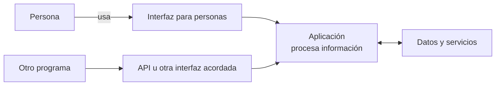
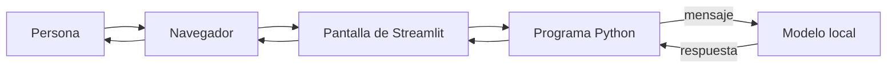
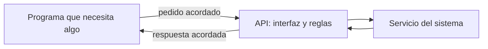
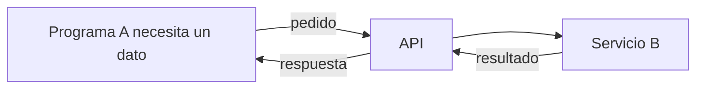
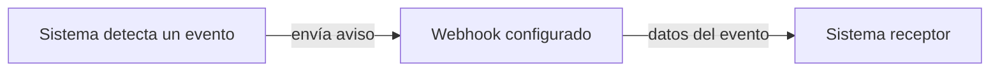
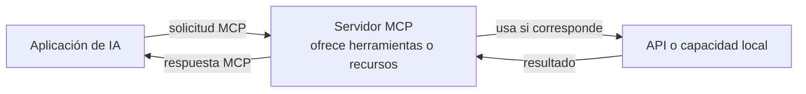
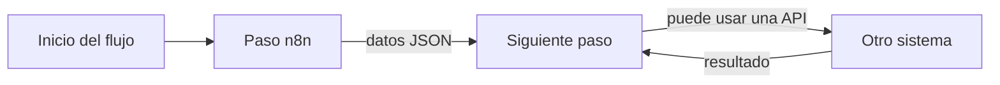
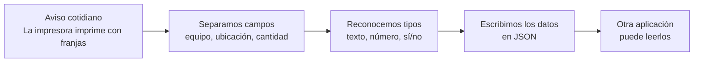

# Clase 5: Cómo hablan los sistemas

**Capacitación en Inteligencia Artificial y Automatización Aplicada a Soporte Técnico**  
**Duración:** 120 minutos  
**Modalidad:** explicación breve, demostración y práctica en equipos  
**Nivel:** inicial, sin conocimientos previos de APIs o JSON

## Objetivo general

Comprender cómo se organiza la información de una solicitud, reconocer el tipo de sus datos y seguir su recorrido entre una interfaz web y un servicio usando ejemplos sencillos de JSON.

## Resultados esperados

Al finalizar la clase vas a poder:

- explicar con tus palabras qué significa integrar dos aplicaciones;
- distinguir una interfaz web para personas de una API para programas;
- explicar por qué los sistemas ofrecen APIs y distinguir conceptualmente API, webhook y MCP;
- reconocer un pedido y una respuesta en un ejemplo;
- clasificar datos cotidianos como texto, número, sí/no o sin valor;
- leer claves y valores en un objeto JSON sencillo;
- relacionar un dato conocido con su representación en JSON;
- identificar qué dato cambió, cuál se conservó y cuál falta;
- explicar por qué no corresponde completar información que no fue informada.

## Preparación

No hace falta instalar programas ni tener experiencia previa. La práctica usa el archivo local [`ejemplos_integraciones.json`](ejemplos_integraciones.json), que contiene datos ficticios. Se puede mostrar en el TV compartido o imprimir una copia para cada equipo.

## Recorrido de la clase

| Tiempo | Actividad |
|---:|---|
| 0–10 min | Situación inicial |
| 10–25 min | El software y cómo se conectan sus partes |
| 25–45 min | API, webhook, MCP y automatización: mapa conceptual |
| 45–55 min | Separar una solicitud en datos y reconocer sus tipos |
| 55–70 min | Representar esos mismos datos en JSON |
| 70–80 min | Demostración compartida |
| 80–105 min | Práctica en equipos |
| 105–115 min | Puesta en común |
| 115–120 min | Cierre y conexión con el próximo encuentro |

## 1. Situación inicial

Llega este aviso:

> La impresión de prueba de una impresora de tickets sale con franjas. Ocurre en un sector de práctica.

Una persona registra el pedido en una aplicación. Otra aplicación recibe algunos datos y devuelve una respuesta de recepción. La información puede pasar de una aplicación a otra sin que alguien tenga que volver a escribir cada campo.

Antes de leer los ejemplos, pensá:

- ¿Qué datos conviene registrar para identificar el pedido?
- ¿Qué información se comunicó y qué cosas todavía no sabemos?
- Si una aplicación devuelve una confirmación, ¿eso significa que ya se encontró la causa del problema?


## 2. El mundo del software: personas, programas y datos

Un sistema de software puede tener varias partes: una pantalla para que lo use una persona, instrucciones que procesan información, datos que el sistema conserva y una o más interfaces para comunicarse con otros programas.



En la clase anterior usaste un chatbot hecho con Streamlit. La persona escribió en una pantalla del navegador; el programa Python recibió el mensaje, consultó el modelo local y mostró la respuesta.



Esta app web tenía una interfaz para personas. En esa práctica, Python usaba directamente el modelo local; no vimos una API publicada para que otra aplicación la usara.

> **Idea importante:** una aplicación web no es automáticamente una API. Un sistema puede tener una pantalla para personas, una API para programas, ambas o ninguna de las dos. Una API tampoco necesita mostrar una página web.

## 3. ¿Por qué conectar sistemas?

Las aplicaciones suelen crearse para tareas distintas y pueden guardar la información de maneras diferentes. Cuando necesitan colaborar, alguien podría copiar datos manualmente o se puede acordar una forma para que un programa entregue información a otro.

Una **integración** conecta partes de software para intercambiar información o pedir una tarea. La integración necesita acuerdos: qué se puede pedir, qué datos hacen falta, cómo se representan y qué respuesta se puede esperar.

Una **API** (interfaz de programación de aplicaciones) es ese tipo de interfaz acordada para que un programa pueda usar funciones o datos que otro sistema ofrece. Existe para que cada programa no tenga que conocer todos los detalles internos del otro. 
**El acuerdo describe qué se puede pedir y qué respuesta corresponde.**

Muchas APIs usan tecnología web, pero una API también puede ser una interfaz local de una biblioteca o del sistema operativo.

> **Ejemplo**: un programa que necesita información de otro puede enviar un pedido a la API y recibir una respuesta. La API hace explícito el punto de contacto y las reglas del intercambio.



Sin un acuerdo, un programa tendría que adivinar cómo funciona el otro o depender de sus detalles internos. Una API hace explícito el punto de contacto. No significa que el acceso sea público: puede requerir permisos y limitar qué información o acciones están disponibles.

## 4. API, webhook y MCP: ideas distintas

Estos nombres no describen exactamente la misma cosa ni se excluyen entre sí. Un sistema puede ofrecer una API, enviar notificaciones tipo webhook y, además, ser accesible desde una aplicación de IA mediante MCP.

Para no mezclarlos: 
- **API** es una interfaz acordada; 
- **webhook** es un patrón de aviso por evento; 
- **MCP** es un protocolo para conectar aplicaciones de IA con herramientas o recursos; 
- **JSON** es un formato de datos; 
- **n8n** es una herramienta que orquesta pasos.

| Concepto | Quién inicia el intercambio | Para qué sirve | Imagen mental |
|---|---|---|---|
| Copia o archivo | Una persona o proceso exporta y otro importa. | Pasar información sin conexión directa entre aplicaciones. | Entregar una planilla o archivo preparado. |
| API | El programa que necesita algo envía un pedido. | Consultar información o solicitar una operación siguiendo un acuerdo. | Preguntar en una ventanilla cuando necesitás un dato. |
| Webhook | El sistema que detecta un evento envía un aviso. | Notificar a otro sistema cuando ocurre algo, por ejemplo, al registrarse una solicitud. | Recibir un aviso cuando sucede algo, sin estar preguntando cada minuto. |
| Cola de mensajes | Un productor publica un mensaje y otro proceso lo toma cuando puede. | Desacoplar sistemas y procesar mensajes de forma asíncrona. | Dejar un turno en una bandeja para que se atienda después. |
| MCP | Una aplicación de IA solicita capacidades a un servidor MCP. | Ofrecer una forma común para que aplicaciones de IA descubran y usen herramientas o recursos. | Un conector con reglas comunes entre una aplicación de IA y herramientas disponibles. |

No existe una única forma de conectar sistemas ni esta tabla agota todas las opciones. También se pueden compartir bases de datos u orquestar pasos con herramientas de automatización; cada opción tiene requisitos y riesgos distintos. En esta introducción nos interesa reconocer las familias y elegir JSON para la práctica.

### API: un pedido cuando hace falta

El programa que necesita información inicia un pedido y recibe una respuesta. Puede usar una API web o una interfaz local. JSON es un formato posible para los datos, no la API misma.



### Webhook: un aviso cuando ocurre algo

El sistema que detecta un evento envía un aviso al destino que fue preparado para recibirlo. Es común que el aviso contenga datos en JSON y use tecnología web. Conceptualmente, el intercambio comienza por el evento, no porque el receptor esté preguntando en ese momento.



### MCP: una forma común para herramientas de IA

**MCP** significa *Model Context Protocol*. Es un protocolo que permite que una aplicación de IA se comunique de manera acordada con servidores que ofrecen herramientas o recursos. Por ejemplo, una aplicación de IA puede pedir al servidor MCP una herramienta disponible; ese servidor puede conectarla con una API existente o con una capacidad local.



MCP no es un modelo de IA, no es n8n y no reemplaza automáticamente las APIs o los sistemas conectados. Surgió para reducir la necesidad de crear una integración distinta entre cada aplicación de IA y cada herramienta: un acuerdo común permite que clientes compatibles se conecten con distintos servidores compatibles.

Como MCP se ha popularizado, hay servidores MCP ofrecidos por distintos proyectos y proveedores; cada uno puede exponer herramientas y recursos diferentes. Compartir el protocolo no hace que sus capacidades sean iguales ni garantiza que un servidor sea confiable. Antes de usar uno, hay que revisar quién lo ofrece, qué puede consultar o hacer y qué permisos recibe.

### ¿Dónde entra n8n?

n8n es una herramienta para armar automatizaciones que coordinan pasos entre sistemas. Puede recibir un inicio, llamar APIs, procesar datos y continuar el flujo. No es otro formato de datos ni otro protocolo como MCP.

En los primeros flujos del curso, los nodos van a recibir y entregar datos estructurados, representados principalmente como JSON. Cada nodo puede agregar, conservar o transformar campos. Por eso JSON será el foco práctico de esta clase y de la próxima; API, webhook y MCP quedan como mapa conceptual.



En la próxima clase vas a construir pasos en n8n. Para esta clase alcanza con conocer este mapa; no vamos a configurar APIs, webhooks ni servidores MCP.

## 5. Primero: una solicitud contiene datos

Antes de mirar JSON, leé la solicitud como una persona de soporte. Después separala en datos que se pueden nombrar:

| Dato que necesitamos | Valor del caso | Tipo de dato, dicho simple |
|---|---|---|
| Equipo | Impresora de tickets de práctica | Texto |
| Ubicación | Sector de práctica | Texto |
| Equipos afectados | Uno | Número |
| Información confirmada | Sí | Sí/no |
| Código del equipo | Todavía no se informó | Sin valor disponible |

Un **tipo de dato** describe qué clase de valor tenemos. Ayuda a evitar confusiones: una cantidad sirve para contar; una ubicación se lee como texto; una respuesta de sí/no no es una frase larga.

En grupos, primero ubiquen cada dato en una de estas categorías: **texto**, **número**, **sí/no** o **todavía sin valor**. Todavía no hace falta conocer nombres técnicos.

## 6. El mismo pedido, escrito en JSON

**JSON** es un formato de texto para representar datos de manera ordenada y que distintas aplicaciones puedan interpretarlos. No es una aplicación ni una API: es una forma de escribir la información.

Este diagrama muestra el puente desde algo conocido hasta su representación:



Ahora observá cómo se escriben los mismos datos:

```json
{
        "equipo": "Impresora de tickets de práctica",
        "ubicacion": "Sector de práctica",
        "equipos_afectados": 1,
        "informacion_confirmada": true,
        "codigo_equipo": null
}
```

Leelo como pares de **nombre del dato** y **valor**:

- `"ubicacion"` es el nombre del dato; `"Sector de práctica"` es su valor.
- `1` representa un número.
- `true` representa sí; `false` representa no.
- `null` indica que el campo está incluido, pero no tiene un valor disponible.
- Si una clave no aparece, el campo no fue incluido en ese objeto. No es igual a escribir la clave con `null`.

Las llaves `{ }` encierran el objeto. Los dos puntos separan cada nombre de su valor y las comas separan un par del siguiente. El texto usa comillas dobles; los números, `true`, `false` y `null` no.

`1` y `"1"` no son lo mismo: el primero es un número y el segundo es texto. Un sistema puede tratarlos de manera diferente.

### Variables y parámetros

El nombre de un campo puede mantenerse mientras cambia su valor entre solicitudes. Por ejemplo, `ubicacion` puede tener el valor `"Sector de práctica"` en un pedido y otro texto en el siguiente. En un programa, una **variable** es un nombre que permite trabajar con un valor que puede cambiar; el JSON muestra los datos, pero por sí solo no muestra cómo el programa guarda o modifica ese valor.

Un **parámetro** es un dato que se entrega para precisar qué se está pidiendo. Por ejemplo, el identificador `solicitud_id` puede indicar cuál solicitud se quiere consultar. En esta clase alcanza con reconocer su función; no vamos a escribir código ni direcciones técnicas.

## 7. Demostración compartida

Abrí [`ejemplos_integraciones.json`](ejemplos_integraciones.json). Antes de leer el objeto, identificá en voz alta un campo de texto, uno numérico, uno de sí/no y uno sin valor. Después observá `entrada` y `respuesta`.

1. Localizá `solicitud_id` en la entrada y en la respuesta. ¿Se conserva el mismo valor?
2. Buscá `estado` y `mensaje` en la respuesta. ¿Aparecían en la entrada?
3. Identificá qué claves tienen texto, número, `true` y `null`.
4. Compará la `ubicacion` de la entrada y de la respuesta.

La demostración permite ver el mismo pedido primero como información conocida y luego como JSON. No se ejecuta una aplicación: la respuesta es un ejemplo preparado para aprender a leer los datos.

## 8. Práctica: seguir los datos

Trabajá en equipo. Usen el JSON que se muestra en el TV. Pueden turnarse para leer, marcar datos y presentar las conclusiones.

### Parte A: encontrar los datos y sus tipos

En la sección `entrada`:

1. Rodeá las claves y subrayá sus valores.
2. Clasificá cada valor como texto, número, sí/no o sin valor.
3. Señalá el identificador de la solicitud.
4. Respondé: ¿qué se informó sobre la impresora? ¿Qué dato no está disponible?

### Parte B: comparar con la respuesta

1. Buscá los campos que aparecen tanto en `entrada` como en `respuesta`.
2. Marcá los campos que aparecen solo en la respuesta.
3. Explicá qué confirma la respuesta y qué no permite saber.
4. Escribí una pregunta que serviría para completar la información faltante, sin inventar una respuesta.

## 9. Ejercicio final: proponer un caso real

### Aplicar a caso de trabajo en Casinos Play

Consigna: 
- Analizar un flujo de trabajo conocido en Casinos Play y que involucre al menos 2 sistemas,
- Encontrar datos que podems usar para conectar estos sistemas
- Validar que se puede realizar la conexion o si por el contrario el sistema actual no lo permite,
- Detallar que datos incluirian al generar una consulta,
- Explicar que ganarian al tener una respuesta en JSON y que datos se conservarian, cambiarian o faltarían.

### Resultado del equipo

Prepará una explicación breve que incluya:

- Flujograma de los sistemas involucrados y cómo se comunican.
- Lista de datos que se pueden usar para la integración.   
- JSON de ejemplo con los datos que se enviarían y los que se recibirían.